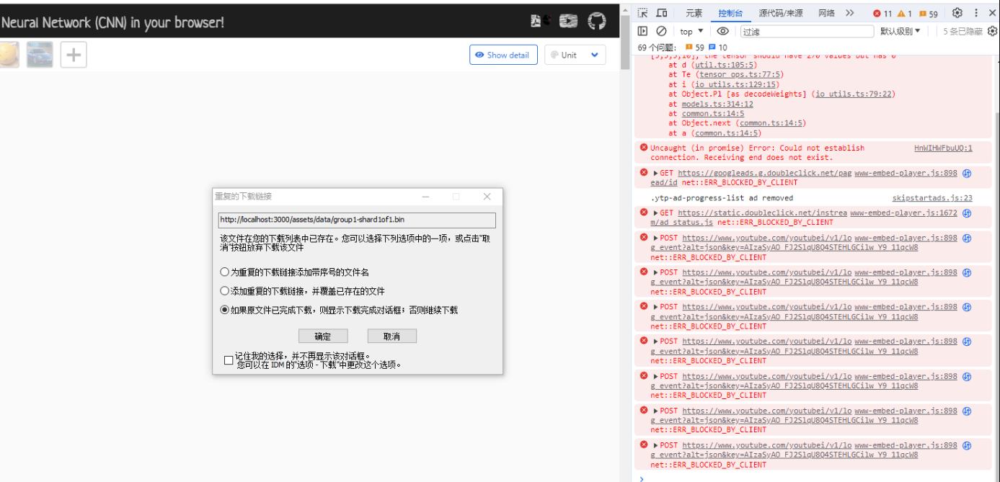

# CNN Explainer Ⅰ: Resolving the Interface Issue

Recently, I runed a CNN Explainer, a wonderful visualization repository
on [GitHub](https://github.com/poloclub/cnn-explainer). The author provides a straightforward workflow, but I
encountered a frustrating bug: the interface was blank. In this blog, I will outline the steps I took to resolve this
issue.

Firstly, I thoroughly examined all
the [related issues](https://github.com/poloclub/cnn-explainer/issues?q=is%3Aissue+is%3Aclosed) in the original
repository and discovered that the error log in the console panel of web was crucial.

Next, I conducted a Google search to gather some insights. I came across
a [helpful webpage](https://stackoverflow.com/questions/61381112/uncaught-error-based-on-the-provided-shape-1024-3-the-tensor-should-have-30)
that suggested the problem may be caused by the web browser's failure to upload the model. The page also provided
a [link](https://github.com/tensorflow/tfjs/issues/805#issuecomment-431169962) with a detailed explanation.

To my delight, this suggestion turned out to be correct! Following the advice, I checked the network panel and
discovered that IDM (a downloader) was interfering. To resolve
this, [I simply deleted IDM from my system](https://www.ruby-forum.com/t/how-to-get-rid-of-204-intercepted-requests-of-idm/236594).

Everything is done! Thought this annoying bug occupied my whole daytime.🥳🥳🥳

 



 

<!--头像获取：https://github.com/walinejs/waline/issues/532-->

当前页阅读量为:
