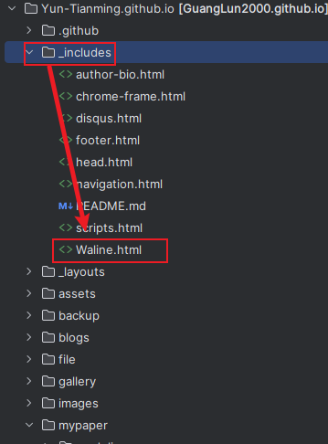

# 一个博客的诞生

在三天两夜的奋战中，这个潦草的个人博客终于完成啦😊过程总的来说是愉快的，这里非常感谢hanlin的慷慨，没有他详细的教程就不会出现这个博客~你如果你想搭建一个属于自己的博客，非常推荐[这篇文章](https://caihanlin.com/blogs/web/)，它可以解决99%问题。

我呢在搭建过程中遇到两个比较棘手的问题：**一个是域名解析，一个是评论系统。**在这里记录下我解决两个问题的主要步骤，这样既可以给有类似问题的同学做个参考，也方便日后需要时回来查看。

## 域名解析

如果你像我一样是接受不了github自带域名**[Yun-Tianming.github.io](https://github.com/Yun-Tianming/Yun-Tianming.github.io)**，想更优雅地进入自己的博客[https://blog.luofu.monster/](https://blog.luofu.monster/)，域名解析则是一个必不可少的步骤。需要如下几步实现：

1. 购买域名，推荐购买国外的域名。国内的域名需要一系列复杂的步骤，国外的买来几乎就能用。
2. 解析域名，一个通用的解决方式是把域名先挂载到[cloudflare](https://dash.cloudflare.com/)上，在进行DNS解析。[这个博主](https://naiyous.com/662.html)录制了详细的操作过程，我照着整体下来还是很流畅的。解析设置如下：

| 类型 | 名称 | 内容 |
| --- | --- | --- |
| CNAME | blog（你的二级域名） | yun-tianming.github.io（需要代理的域名） |
1. 一个小tips，如果要买域名的话建议2~3年起买，一年折扣固然很便宜，但是在你到期想要续费的时候，续费价格会让你怀疑人生😭（别问我怎么知道的😭）

## 评论系统

hanlin部署了一个优秀评论系统，唯一的问题是太贵了（当然这是我的问题😥我采用了一种替代方案——[Waline](https://waline.js.org/)，他是免费的而且支持各种[自定义设置](https://waline.js.org/cookbook/)，你可以在这里[快速上手](https://waline.js.org/guide/get-started/)，过程非常简单。

过程的最后会得到一个html文件，我将它命名为***Waline.html，***内容如下：

```html
<head>
    <!-- ... -->
    <link
            rel="stylesheet"
            href="https://unpkg.com/@waline/client@v2/dist/waline.css"
    />
    <!-- ... -->
</head>
<body>
<!-- ... -->
<div id="waline"></div>
<script type="module">
    import { init } from 'https://unpkg.com/@waline/client@v2/dist/waline.mjs';

    init({
        el: '#waline',
        serverURL: 'https://coment-system.vercel.app',  //改成自己的服务器
        emoji: [
            '//unpkg.com/@waline/emojis@1.1.0/tieba',
            '//unpkg.com/@waline/emojis@1.1.0/bilibili',
            '//unpkg.com/@waline/emojis@1.1.0/tw-emoji',
        ],
        reaction: [
            '//unpkg.com/@waline/emojis@1.1.0/tw-emoji/1f60e.png',
            '//unpkg.com/@waline/emojis@1.1.0/tw-emoji/1f642.png',
            '//unpkg.com/@waline/emojis@1.1.0/tw-emoji/2639.png',
            '//unpkg.com/@waline/emojis@1.1.0/tw-emoji/1f92e.png',
            '//unpkg.com/@waline/emojis@1.1.0/tw-emoji/1f612.png',
            '//unpkg.com/@waline/emojis@1.1.0/tw-emoji/1f616.png',
        ],
        locale: {
            reactionTitle: 'What do you think of this blog?',
        },

        pageview: true, // 浏览量统计
        comment: true, // 评论数统计
    });
</script>
</body>
```

如果你想[像我一样](https://blog.luofu.monster/comments/)把这个**评论系统嵌入自己的博客**的话，可以试试我的方法（ps，这只是我的尝试，并没有官方文档依据，欢迎大家分享自己的做法）：

- 把***Waline.html***文件放到***_includes***文件夹下



- 在你想要嵌入评论系统的文件（例如index.md,comments.md)前如下面代码：

```html
<br>

 

<br>
```

大功告成！😝

<br>





<br>

<!--头像获取：https://github.com/walinejs/waline/issues/532-->

当前页阅读量为:
<span class="waline-pageview-count" data-path="/_includes/Waline.html" />