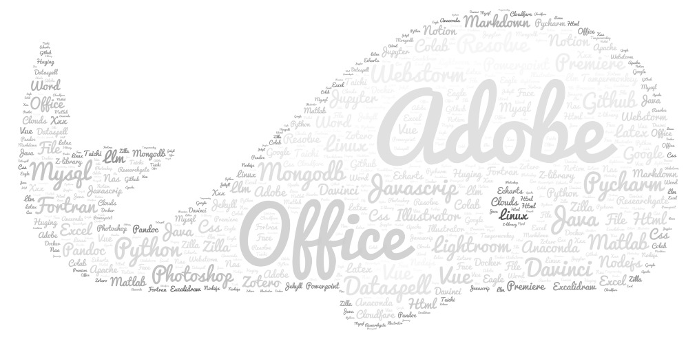

Latest Update: 9th Sep 2025 &nbsp;

# About Me

Here is Fanyi Meng ([孟凡祎](https://yun-tianming.github.io/file/CV_2.pdf)). You can also call me **Luofu**, which is one of my favorite nicknames.

I am currently pursuing my studies in Marine Science at [Shanghai Ocean University](https://www.shou.edu.cn/), with a research focus on using mathematical modeling to unravel the mysteries of the Southern Ocean ecosystem. My ultimate aspiration is to immerse myself in the enchanting and breathtaking beauty of Antarctica, experiencing its awe-inspiring landscapes firsthand.

 

## Academic Background

- **Sep 2019 - June 2023:** Shanghai Ocean University (Bachelor)
- **2023 - Present:** Shanghai Ocean University / Third Institute of Oceanography, Ministry of Natural Resources (M.S., Marine Biology)  
  Thesis: Simulation Study of Marine Extreme Events in the Scotia Sea, Antarctica

 

---

## Skills

I learned almost all my skills from the internet. Now I represent them as word art. [See more](https://circular-kettle-026.notion.site/Cyber-skills-f142f39dc38048d8bde60bcfc83411e2).

 

---

## Research Interests

- Marine mammal ecology and behavioral ecology
- Cetacean habitat distribution and ecological hotspots
- Antarctic ecosystem modeling and top predator dynamics
- Avian habitat and breeding behavior

I am a dedicated Master's student specializing in marine mammal ecology and behavioral ecology (GPA: 3.8/4.0). My work focuses on investigating cetacean habitat distribution along the Taiwan Strait, analyzing ecological hotspots of top predators in the Southern Ocean, and contributing to avian habitat and breeding behavior surveys.

I am proficient in applying mathematical modeling to ecological challenges and possess extensive fieldwork experience. I am driven by discovering patterns in data and validating hypotheses in the field.

 

---

## Volunteer Projects and Activities

- **Sep-Oct 2023:** Avian collision investigation at Shanghai Ocean University.

- **Sep 2023:** Bird Survey in Nanhui District, Shanghai.

- **Jun-Jul 2023:** Owl Habitat Survey in Jilin Province Dagangzi.

 

---

## Chat with Me

If you are a user of Chinese real-time communication software, these methods of contacting me may be more convenient:

- QQ: 2379533384
- WeChat: beinor12e