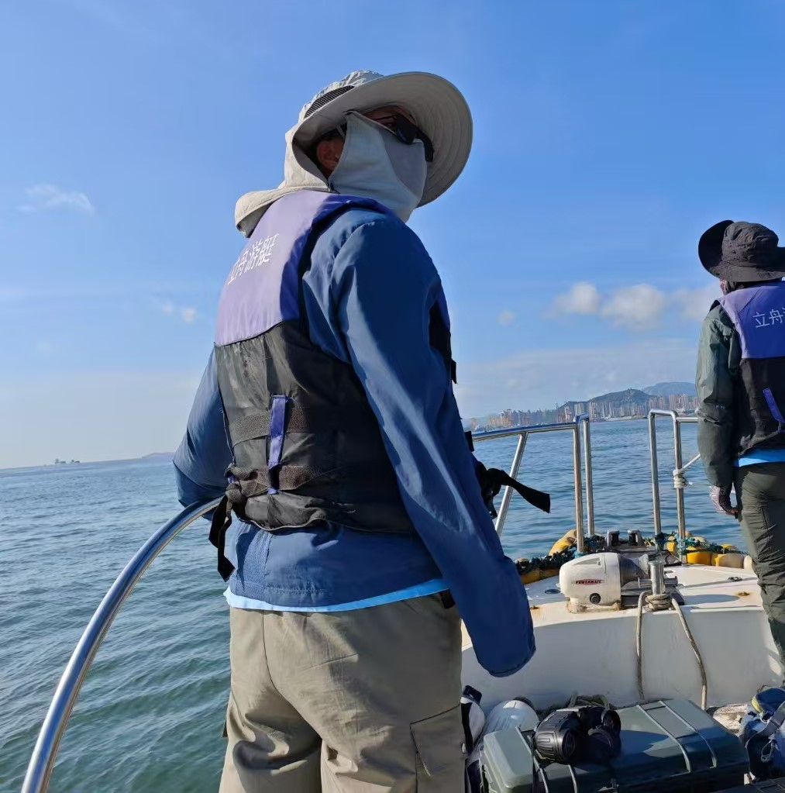

Latest Update: 9th Sep 2025 &nbsp;

# About Me

Here is Fanyi Meng ([孟凡祎](https://yun-tianming.github.io/file/CV.pdf)). You can also call me **Luofu**, which is one of my favorite nicknames.

I am currently pursuing my studies in Marine Science at [Shanghai Ocean University](https://www.shou.edu.cn/), with a research focus on using mathematical modeling to unravel the mysteries of the Southern Ocean ecosystem. My ultimate aspiration is to immerse myself in the enchanting and breathtaking beauty of Antarctica, experiencing its awe-inspiring landscapes firsthand.

 

## Academic Background

- **Sep 2019 - June 2023:** Shanghai Ocean University (Bachelor)
- **2023 - Present:** Shanghai Ocean University / Third Institute of Oceanography, Ministry of Natural Resources (M.S., Marine Biology)  
  Thesis: Simulation Study of Marine Extreme Events in the Scotia Sea, Antarctica

 

---

## Skills

I learned almost all my skills from the internet. Now I represent them as word art. [See more](https://circular-kettle-026.notion.site/Cyber-skills-f142f39dc38048d8bde60bcfc83411e2).

 

---

## Research Interests

- Marine mammal ecology and behavioral ecology
- Cetacean habitat distribution and ecological hotspots
- Antarctic ecosystem modeling and top predator dynamics
- Avian habitat and breeding behavior

I am a dedicated Master's student specializing in marine mammal ecology and behavioral ecology (GPA: 3.8/4.0). My work focuses on investigating cetacean habitat distribution along the Taiwan Strait, analyzing ecological hotspots of top predators in the Southern Ocean, and contributing to avian habitat and breeding behavior surveys.

I am proficient in applying mathematical modeling to ecological challenges and possess extensive fieldwork experience. I am driven by discovering patterns in data and validating hypotheses in the field.

 

---

## Fieldwork and Research Experience

### Cetacean Habitat Surveys, Taiwan Strait
**Core Team Member | 2024 - Present**

- Conducted long-term monitoring of Indo-Pacific humpback dolphins (*Sousa chinensis*) and Indo-Pacific finless porpoises (*Neophocaena phocaenoides*).
<table>
    <tr>
        <td >

</td>
        <td >

</td>
    </tr>
</table>
- Designed systematic line-transect surveys and performed rigorous data analysis, which led to the confirmation of a resident population of Indo-Pacific bottlenose dolphins(*Tursiops aduncus*) and Common dolphin (Delphinus delphis). 
<table>
    <tr>
        <td >

</td>
        <td >

</td>
        <td >

</td>
    </tr>
</table>
- Provided critical data and analysis for regional conservation, contributing directly to a publication in *Marine Mammal Science* .
<table>
    <tr>
        <td >

</td>
        <td >

</td>
    </tr>
</table>

### Ecological Hotspots of Top Predators, Southern Ocean
**Researcher | 2023 - Present**

- Analyzed observational data from the 38th-41st Chinese National Antarctic Research Expeditions (CHINARE) to map the spatiotemporal distribution of apex predators.
<table>
    <tr>
        <td >

</td>
    </tr>
</table>
- My master's thesis aims to identify and explain the formation mechanisms of ecological hotspots for key species (e.g., southern elephant seals, cetaceans) by developing robust ecological niche models.
<table>
    <tr>
        <td >

</td>
        <td >

</td>
        <td >

</td>
    </tr>
</table>

### Applications of Deep Learning in Oceanography
**Researcher | 2022 - Present**

- Independently developed a Generative Adversarial Network (GAN) to model fishing vessel behavior in the Antarctic krill fishery, with results published in *Fisheries Research*.
<table>
    <tr>
        <td >

</td>
        <td >

</td>
    </tr>
</table>

- Currently leading two projects: 1) developing a deep learning model to simulate marine extreme events, and 2) using remote sensing imagery to automate the identification of marine mammal aggregations.
<table>
    <tr>
        <td >

</td>
        <td >

</td>
    </tr>
</table>

### Avian Ecology, Xiamen & Multiple Regions
**Field Researcher | 2024 - Present**

- Monitored breeding sites of blue-tailed bee-eaters (*Merops philippinus*) and Eurasian oystercatchers (*Haematopus ostralegus*).
<table>
    <tr>
        <td >

</td>
        <td >

</td>
        <td >

</td>
    </tr>
</table>
- Conducted urban and waterbird surveys and monitoring across various regions to assess population dynamics and habitat health.
<table>
    <tr>
        <td >

</td>
        <td >

</td>
        <td >

</td>
    </tr>
</table>

 

---

## Volunteer Projects and Activities

- **Sep-Oct 2023:** Avian collision investigation at Shanghai Ocean University.

<table>
    <tr>
        <td>

</td>
    </tr>
</table>

- **Sep 2023:** Bird Survey in Nanhui District, Shanghai.

<table>
    <tr>
        <td>

</td>
    </tr>
</table>

- **Jun-Jul 2023:** Owl Habitat Survey in Jilin Province Dagangzi.

<table>
    <tr>
        <td>

</td>
    </tr>
</table>

 

---

## Chat with Me

If you are a user of Chinese real-time communication software, these methods of contacting me may be more convenient:

- QQ: 2379533384
- WeChat: beinor12e